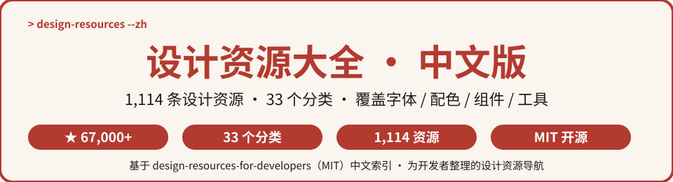
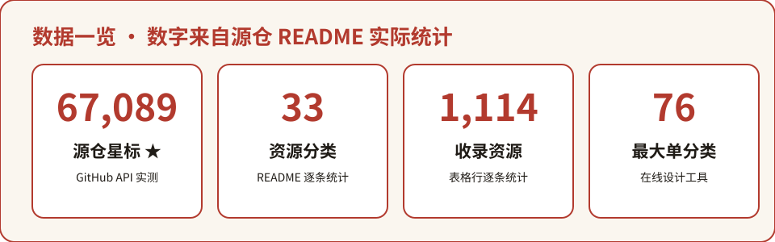
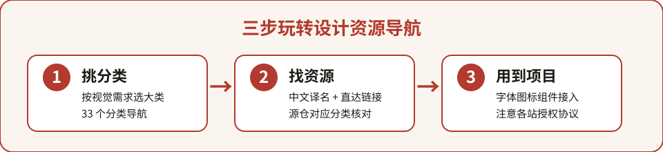

  

# design-resources-for-developers 中文版

> **面向开发者的设计资源导航 · 中文导读版**
>
> 源自 GitHub 上 **67,000+ ★** 的 [bradtraversy/design-resources-for-developers](https://github.com/bradtraversy/design-resources-for-developers)，整理 **33 个资源分类、1,114 条设计资源**——从字体、配色、图标到 UI 框架、设计工具与灵感站，是开发者做界面时「找素材、找工具、找灵感」的一站式导航。

---

⭐ 如果对你有帮助，点个 Star 支持中文开源

## 目录

- [这是什么？](#这是什么)
- [为什么值得收藏](#为什么值得收藏)
- [数据一览](#数据一览)
- [快速开始](#快速开始)
- [分类清单](#分类清单)
- [全量资源索引](#全量资源索引)
- [完整数据](#完整数据)
- [常见问题 FAQ](#常见问题-faq)
- [参与贡献](#参与贡献)
- [致谢](#致谢)
- [许可声明](#许可声明)

---

## 这是什么？

**设计资源大全 · 中文版** 是对 Brad Traversy 的知名开源导航 [bradtraversy/design-resources-for-developers](https://github.com/bradtraversy/design-resources-for-developers)（GitHub **67,089 ★**，MIT License）的中文二次开发项目。

源项目专门为**开发者**而不是设计师整理设计资源：当你写页面需要一张配图、一套配色、一个图标库、一个组件框架，或者想找个设计网站找找灵感时，不用再满世界翻——这个仓库把 **1,114 个经过社区筛选的资源站**按 33 个分类收拢成一张大表，几乎覆盖 UI 开发的所有视觉需求。

**中文版做了什么：**

- 🗂️ 把源仓 **33 个分类、1,114 条资源** 整理为中文全量索引（[resources-index.md](resources-index.md)），每条附源 README 锚点直达链接；
- ⚡ 在本 README 精选常用分类与代表资源，配中文译名 + 一句话用途；
- 📖 提炼「找资源 → 用资源」的上手路径与 FAQ，英文站列表也不再劝退。

## 为什么值得收藏

- 🎨 **一站覆盖 UI 视觉全链路**：字体 → 配色 → 图标 → 图片/视频/音乐素材 → 模板 → 组件库 → 设计工具 → 灵感，做界面要用的资源这里都分好类；
- 🧑‍💻 **专为开发者视角**：不是泛泛的设计站大全，而是直接给代码能用的东西——Tailwind、Bootstrap、React/Vue/Angular 组件库、图表库、动画库一应俱全；
- 🆓 **大量免费可商用**：Unsplash、Pexels、Google Fonts、Feather Icons 等主流免费资源站全部收录，授权信息以源仓列表为准；
- 🧩 **框架生态齐全**：React 74 个、Vue 43 个、Angular 18 个、Svelte 14 个、React Native 12 个 UI 库，跨框架选型不愁；
- 🇨🇳 **中文友好**：全量分类索引 + 精选译名 + 使用场景说明，点开即知这个站是干什么的。

## 数据一览

  

> 数字全部来自源仓 [README.md](https://github.com/bradtraversy/design-resources-for-developers/blob/master/README.md) 实际统计（2026-10-05 核实）：33 个资源分类、1,114 条表格资源条目；星数为 GitHub API 实测 67,089。

## 快速开始

### 三步上手

  

1. **挑分类**：按你当下缺什么选大类——做视觉素材看「配色/图标/图库」，写组件看「CSS 框架/React UI 库」，找灵感看「设计灵感」；
2. **找资源**：在对应分类里挑一个站（中文版附中文译名与一句话说明），点链接跳到源仓对应分类核对完整列表；
3. **用到项目**：把选中的字体/图标/图片/组件库接入你的项目，注意按各资源站的授权协议使用。

### 示例：给落地页配一套配色 + 配图

1. 打开 [配色方案 Colors](https://github.com/bradtraversy/design-resources-for-developers/blob/master/README.md#colors)，用 Colormind.io 或 Color Brewer 挑一组主色 + 辅助色；
2. 打开 [免费图库 Stock Photos](https://github.com/bradtraversy/design-resources-for-developers/blob/master/README.md#stock-photos)，从 Unsplash / Pexels 找一张免费可商用的首屏大图；
3. 图标从 [图标库 Icons](https://github.com/bradtraversy/design-resources-for-developers/blob/master/README.md#icons) 选 Feather 或 Tabler，npm 直接装；字体从 Google Fonts 引一行 CSS。

### 示例：给 React 项目选组件库

[React UI Libraries](https://github.com/bradtraversy/design-resources-for-developers/blob/master/README.md#react-ui-libraries) 分类共 74 个库——要 Material 风格选 Material UI，要主题灵活选 Chakra UI / Mantine，字节系团队可看 Semi Design；配套 CSS 框架分类（64 个）里 Tailwind CSS 是当下主流。

## 分类清单

精选 12 个高频分类（完整 33 个分类与 1,114 条资源见 [resources-index.md](resources-index.md)）：

| 中文分类 | 英文原名 | 条目数 | 一句话用途 |
| --- | --- | --- | ---: | --- |
| 配色方案 | Colors | 75 | 生成/挑选网页配色与色板 |
| 图标库 | Icons | 63 | 找开源免费图标 |
| CSS 框架 | CSS Frameworks | 64 | Tailwind / Bootstrap 等布局框架 |
| UI 组件与套件 | UI Components & Kits | 65 | 现成组件块与设计套件 |
| React UI 库 | React UI Libraries | 74 | Material UI / Chakra / Mantine 等 |
| Vue UI 库 | Vue UI Libraries | 43 | Vuetify / Arco Vue 等 |
| 免费图库 | Stock Photos | 38 | Unsplash / Pexels 可商用配图 |
| 字体 | Fonts | 43 | Google Fonts / DaFont 等字体站 |
| 在线设计工具 | Online Design Tools | 76 | Figma / Penpot / Canva 在线作图 |
| 设计灵感 | Design Inspiration | 47 | Dribbble / Behance 找灵感 |
| 图片压缩 | Image Compression | 25 | TinyPNG / Squoosh 压缩瘦身 |
| AI 图形设计工具 | AI Graphic Design Tools | 7 | Leonardo / Galileo AI 等 AI 设计 |

## 全量资源索引

📄 **[resources-index.md](resources-index.md)** — 收录源仓全部 **33 个分类、1,114 条资源**：每个分类给出中文名 + 英文原名 + 条目数 + 源 README 锚点直达链接，并附 3–5 条精选代表资源（中文译名 + 原链接），即点即查。

## 完整数据

- 📦 源仓库：[bradtraversy/design-resources-for-developers](https://github.com/bradtraversy/design-resources-for-developers)（默认分支 `master`，MIT License）
- 📄 源 README（英文原文）：[README.md](https://github.com/bradtraversy/design-resources-for-developers/blob/master/README.md)
- 📝 源贡献指南：[contributing.md](https://github.com/bradtraversy/design-resources-for-developers/blob/master/contributing.md)
- ⭐ 星数实测：67,089 ★（GitHub API，2026-10-05 核实）

## 常见问题 FAQ

**Q1：这些资源都免费吗？可以商用吗？**

源项目本身只做**导航收录**，每个资源站的授权政策各不相同（免费、免费可商用、仅个人使用、付费等）。中文版同样不重新授权——使用前请到对应资源站官网核对 License 条款，再决定能否商用。

**Q2：为什么中文版只有索引，没有把 1,114 条资源全部列出来？**

中文版定位是**中文导读与索引**：33 个分类的完整名单、中文译名与直达链接都在 [resources-index.md](resources-index.md)；每条资源的完整条目仍以源仓 README 为准（点锚点直达），这样既能保持中文可读性，又能和源项目同步更新。

**Q3：我用 Vue / Angular / Svelte，有对应分类吗？**

有。源仓专门为主流框架拆了分类：React UI Libraries（74）、Vue UI Libraries（43）、Angular UI Libraries（18）、Svelte UI Libraries（14）、React Native UI Libraries（12），按你项目所用框架直接进对应分类选型即可。

**Q4：发现某个资源站挂了或者信息过时怎么办？**

资源站会下线、改版。建议：① 先到源仓 README 对应分类确认官方列表是否已更新；② 如果是中文版索引里的译名/链接问题，欢迎提 Issue 或 PR 修正；③ 想新增资源，请按源仓 [contributing.md](https://github.com/bradtraversy/design-resources-for-developers/blob/master/contributing.md) 向源项目提交。

**Q5：这个中文版和源项目是什么关系？**

本项目是源项目的**中文二次开发（索引 + 导读）**，不复制源仓全部条目原文、不替换任何资源链接；所有资源的实际收录、维护与版权归源项目作者 Brad Traversy 及社区贡献者所有，遵循 MIT License。

## 参与贡献

- 🐛 发现译名、分类数或链接错误：提 Issue；
- 🌐 补充 / 修正中文译名与一句话说明：Fork 后修改 [resources-index.md](resources-index.md) 提 PR；
- ➕ 想新增资源站：请到源仓按 [contributing.md](https://github.com/bradtraversy/design-resources-for-developers/blob/master/contributing.md) 提交，源仓更新后我们再同步中文索引。

## 致谢

- 感谢 Brad Traversy 及全体贡献者维护 [design-resources-for-developers](https://github.com/bradtraversy/design-resources-for-developers) 这份超实用的开发者设计资源导航；
- 感谢 1,114 个资源站背后的每一位创作者与维护者；
- 感谢每一位正在用它把界面做得更好看的你 🌟

## 许可声明

- 本仓库代码与文档：**MIT License**（见 [LICENSE](LICENSE)，Copyright (c) 2026 zieang88888）；
- 源项目 [bradtraversy/design-resources-for-developers](https://github.com/bradtraversy/design-resources-for-developers)：**MIT License**（源 LICENSE Copyright (c) 2020 Brad Traversy）；
- 第三方声明与完整署名见 [THIRD_PARTY_NOTICES.md](THIRD_PARTY_NOTICES.md)。

## 姊妹项目

中文开源矩阵，一网打尽开发者的知识库：

- [zhskills · 中文技能库](https://github.com/zieang88888/zhskills)
- [awesome-ai-tools-zh · AI 工具导航](https://github.com/zieang88888/awesome-ai-tools-zh)
- [free-programming-books-zh · 编程书籍大全](https://github.com/zieang88888/free-programming-books-zh)
- [system-design-zh · 系统设计面试](https://github.com/zieang88888/system-design-zh)
- [awesome-python-zh · Python 生态导航](https://github.com/zieang88888/awesome-python-zh)
- [ohmyzsh-zh · 终端效率神器](https://github.com/zieang88888/ohmyzsh-zh)
- [llm-course-zh · LLM 课程导航](https://github.com/zieang88888/llm-course-zh)
